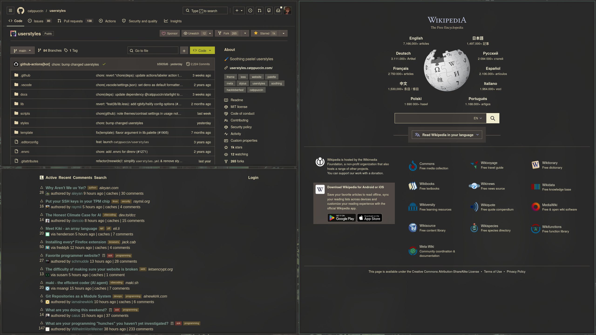

<div align="center">
  
  <br />
  

  # nix-userstyles

  Small flake library for generating Firefox userstyles from the upstream Catppuccin themes, then remapping them to any Base16-compatible palette.

  [](https://github.com/adam01110/nix-userstyles/actions/workflows/ci.yml)
  [](https://github.com/adam01110/nix-userstyles)
  <br />
  [](https://nixos.wiki/wiki/Flakes)
  [](https://github.com/catppuccin/userstyles)
  [](https://support.mozilla.org/en-US/kb/contributors-guide-firefox-advanced-customization)

  [Overview](#overview) - [Usage](#usage) - [Library](#library) - [Development](#development) - [Notes](#notes)
</div>

This repository packages the upstream [`catppuccin/userstyles`](https://github.com/catppuccin/userstyles) themes, compiles them with Nix, and swaps the Catppuccin Mocha palette for your own Base16 palette. It also includes bundled support for the Catppuccin Discord theme.

## Overview

- Exposes three library helpers: `mkUserStyles`, `withExtraCss`, and `mkUserContent`.
- Builds upstream LESS and SCSS sources into a single stylesheet derivation.
- Replaces Catppuccin tokens with Base16 and derived Base24-style color slots.
- Marks generated declarations as `!important` so they win against site styles more reliably.
- Ships example package outputs for plain styles, Firefox-ready `userContent.css`, and appended custom CSS.

## Usage

Add the flake as an input and use one of the exported helpers from `nix-userstyles.lib`.

```nix
{
  inputs = {
    nixpkgs.url = "github:NixOS/nixpkgs/nixpkgs-unstable";
    nix-userstyles.url = "github:adam01110/nix-userstyles";
    nix-colors.url = "github:misterio77/nix-colors";
  };
}
```

### Build Firefox `userContent.css`

```nix
{
  nix-userstyles,
  pkgs,
  ...
}:
let
  nix-colors = builtins.getFlake "github:misterio77/nix-colors";
  palette = nix-colors.outputs.colorSchemes.gruvbox-dark-medium.palette;
  system = pkgs.stdenv.hostPlatform.system;
in {
  home.file.".mozilla/firefox/default/chrome/userContent.css".source =
    nix-userstyles.lib.mkUserContent system {
      inherit palette;
      userStyles = [
        "github"
        "reddit"
        "youtube"
      ];
    };
}
```

### Append your own CSS

```nix
{
  nix-userstyles,
  pkgs,
  ...
}:
let
  nix-colors = builtins.getFlake "github:misterio77/nix-colors";
  palette = nix-colors.outputs.colorSchemes.dracula.palette;
  system = pkgs.stdenv.hostPlatform.system;
in {
  home.file.".mozilla/firefox/default/chrome/userContent.css".source =
    nix-userstyles.lib.mkUserContent system {
      inherit palette;
      userStyles = [
        "github"
        "reddit"
        "youtube"
      ];
      extraCss = ''
        @-moz-document domain("example.com") {
          body {
            outline: 1px solid red !important;
          }
        }
      '';
    };
}
```

### Use a Stylix palette

```nix
{
  config,
  lib,
  nix-userstyles,
  pkgs,
  ...
}:
let
  inherit (lib) filterAttrs hasPrefix;

  palette = filterAttrs (name: _: hasPrefix "base0" name) config.lib.stylix.colors;
  system = pkgs.stdenv.hostPlatform.system;
in {
  home.file.".mozilla/firefox/default/chrome/userContent.css".source =
    nix-userstyles.lib.mkUserContent system {
      inherit palette;
      userStyles = [
        "github"
        "reddit"
        "youtube"
      ];
    };
}
```

> [!NOTE]
> The palette must provide the standard Base16 keys: `base00` through `base0F`. Additional slots used internally for Catppuccin's palette mapping are derived automatically.

## Library

| Export | Role |
| --- | --- |
| `lib.mkUserStyles` | Build generated upstream CSS as a derivation |
| `lib.withExtraCss` | Append additional CSS to an existing stylesheet derivation |
| `lib.mkUserContent` | Build Firefox-ready `userContent.css` in one step |

The repository also exposes a few package outputs on each supported system:

| Output | Role |
| --- | --- |
| `packages.default` | Generated stylesheet using the bundled test style list |
| `packages.user-content` | Firefox-ready `userContent.css` |
| `packages.with-extra-css` | Generated stylesheet with appended custom CSS |
| `packages.test` | Same build used by CI checks |

## Development

From the repository root:

```bash
# Inspect flake outputs
nix flake show --all-systems

# Run CI-equivalent checks
nix flake check

# Format the repository
nix fmt

# Enter the dev shell
nix develop
```

Formatting is configured through `treefmt`.

## Notes

- Style names come from the upstream Catppuccin repositories. The bundled test list in `lib/testUserStyles.nix` is a good reference for known working names.
- `discord` is handled separately from the main `catppuccin/userstyles` tree and is compiled from the upstream SCSS theme.
- The generated CSS is post-processed so every declaration becomes `!important`.

## Credits

- [Original project (`knoopx/nix-userstyles`)](https://github.com/knoopx/nix-userstyles)
- [Catppuccin userstyles](https://github.com/catppuccin/userstyles)
- [Catppuccin Discord theme](https://github.com/catppuccin/discord)
- [nix-colors](https://github.com/misterio77/nix-colors)
